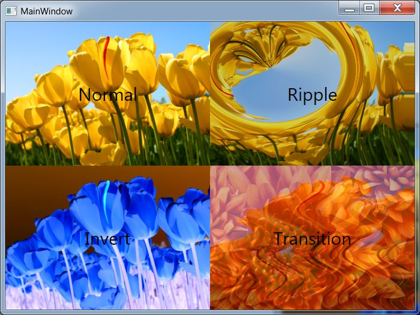

WpfShaderEffects is intended to be out-of- the-box-ready-to-use ShaderEffects for WPF. I lean on the great work that has already been done to use shader effects in WPF (notably wpffx and bling). I hope to provide a library that is easy to use and to change

I owe it to the projects bling.codeplex.com and wpffx.codeplex.com.

Wpffx provided me with the sources for the pixelshaders.

Bling provided me with the idea and code that the DirectX isn't needed in order to compile .fx files. Requiring the full DirectX SDK is cumbersome and Bling had some interesting Interop code to DirectX instead (Originally written by someone named NyaRuRu appearantly).

Basically what I've done is combining the pixelshaders from wpffx, the compiler from bling with some .TT files to autogenerate the WPF classes.

I hope it proves useful

PS Silverlight projects included as well

